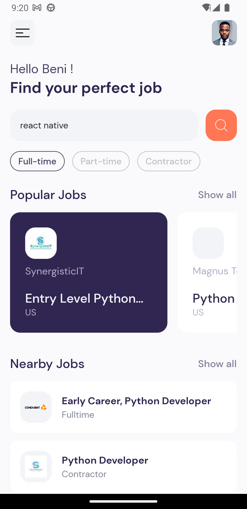
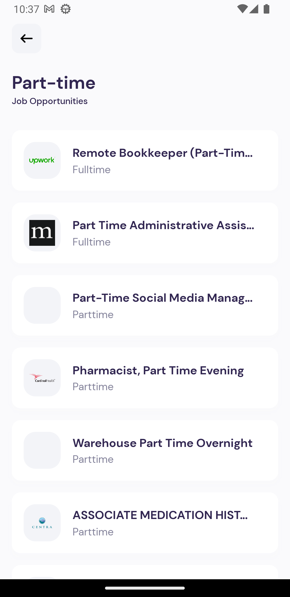
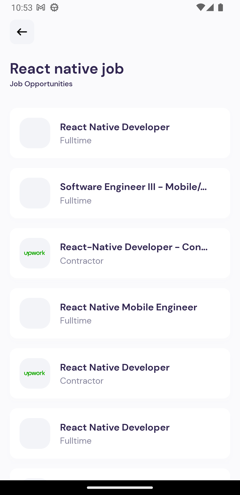

# JobFinder

## Find your dream job everywhere in the world

#Get started with this

- To run the project, Clone the app [JobFinder](https://github.com/benikalonga/JobFinder.git) 👍
- Open the CMD, and change the directory to the root (e.g CD ''../../JobFinder'')
- Run the command npm to install all the dependancies
- Run npm start to start the server
- Or if you have Expo app already, just enter the url and run

### Here is a video showing how it works

https://github.com/benikalonga/JobFinder/assets/29547138/dea1bd2b-3a63-4586-9b2d-0afb829845ee

# Features

- WelcomeScreen
- SearchScreen
- JobDetailScreen

# Depencies and Libraries

[In the Package.json file](package.json)

- "axios": "^1.4.0",
- "expo": "^48.0.7",
- "expo-constants": "~14.2.1",
- "expo-font": "^11.1.1",
- "expo-linking": "~4.0.1",
- "expo-router": "^1.2.0",
- "expo-splash-screen": "~0.18.1",
- "expo-status-bar": "~1.4.2",
- "react": "18.2.0",
- "react-dom": "18.2.0",
- "react-native": "0.71.3",
- "react-native-gesture-handler": "~2.9.0",
- "react-native-reanimated": "~2.14.4",
- "react-native-safe-area-context": "4.5.0",
- "react-native-screens": "~3.20.0",
- "react-native-web": "~0.18.7",
- "expo-updates": "~0.16.4"

# API (Free)

## [DummyJSON](https://jsearch.p.rapidapi.com/) is the free API I used for the entire project

# Architecture (VVM of MVVM)

## Screenshots (Step by step)

 

  
  
  
  
  
  
 

